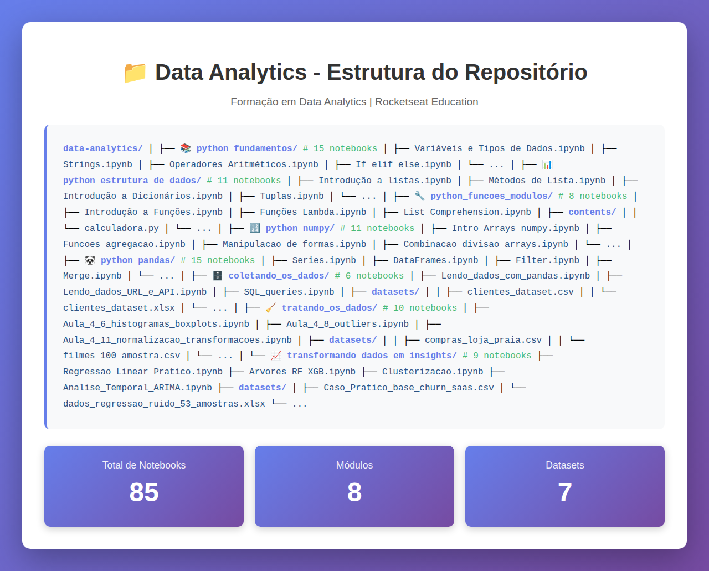
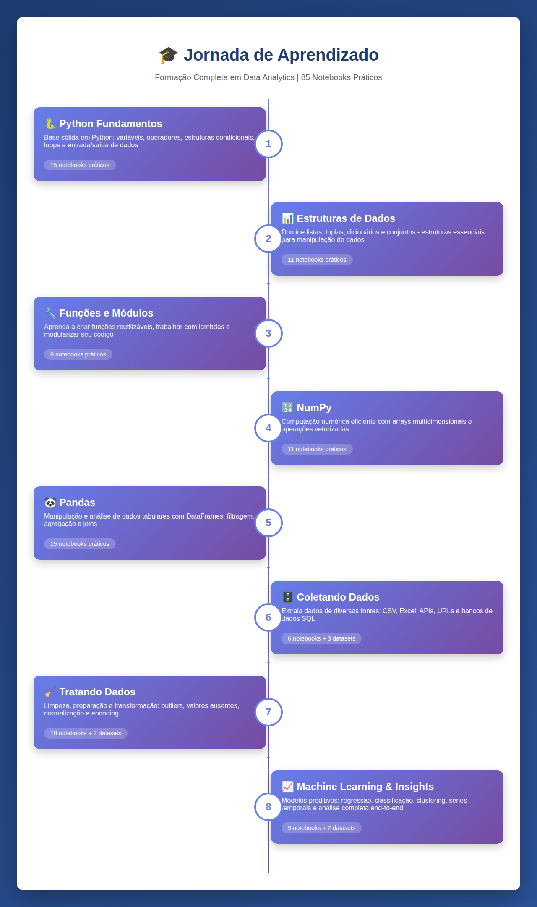

# data-analytics

Este repositório contém os códigos de exemplos práticos da formação em Data Analytics.

## 📁 Estrutura do Repositório



O repositório está organizado em módulos, onde cada pasta representa um módulo específico da formação. Dentro de cada módulo, você encontrará os notebooks Jupyter (`.ipynb`) correspondentes às aulas, além de datasets utilizados nos exemplos práticos.

```
data-analytics/
├── python_fundamentos/              # 15 notebooks
├── python_estrutura_de_dados/       # 11 notebooks
├── python_funcoes_modulos/          # 8 notebooks
├── python_numpy/                    # 11 notebooks
├── python_pandas/                   # 15 notebooks
├── coletando_os_dados/              # 6 notebooks
├── tratando_os_dados/               # 10 notebooks
└── transformando_dados_em_insights/ # 9 notebooks
```

**Total: 85 notebooks práticos**

---

## 🎯 Jornada de Aprendizado

O curso segue uma progressão lógica, do básico ao avançado:



---

## 📚 Conteúdo dos Módulos

### 1. 🐍 python_fundamentos (15 notebooks)
**Fundamentos da linguagem Python**

Introdução aos conceitos básicos de programação em Python:
- `Variáveis e Tipos de Dados.ipynb` - Declaração e tipos de variáveis
- `Comentários em Python.ipynb` - Boas práticas de comentários
- `Strings.ipynb` - Manipulação de texto
- `Formatação de Strings.ipynb` - f-strings e formatação
- `Percorrendo e Fatiando Strings.ipynb` - Slicing e iteração
- `Operadores Aritméticos.ipynb` - Operações matemáticas
- `Operadores Relacionais.ipynb` - Comparações
- `Operadores Lógicos.ipynb` - AND, OR, NOT
- `Operadores Atribuição.ipynb` - Atribuições compostas
- `If elif else.ipynb` - Estruturas condicionais
- `Laço de Repetição FOR.ipynb` - Loops com for
- `Laço de Repetição While.ipynb` - Loops com while
- `While True, Break e Continue.ipynb` - Controle de loops
- `Entrada de Dados em Python.ipynb` - Input do usuário
- `Saída de Dados em Python.ipynb` - Print e formatação

### 2. 📊 python_estrutura_de_dados (11 notebooks)
**Estruturas de dados nativas do Python**

Trabalho com listas, tuplas, dicionários e conjuntos:
- `Introdução a listas.ipynb` - Criação e uso de listas
- `Métodos de Lista.ipynb` - append, insert, remove, pop
- `Percorrendo e fatiando listas.ipynb` - Iteração e slicing
- `Listas Aninhadas.ipynb` - Listas multidimensionais
- `Tuplas.ipynb` - Estruturas imutáveis
- `Introdução a Dicionários.ipynb` - Pares chave-valor
- `Percorrendo dicionários e Métodos.ipynb` - Iteração e métodos
- `Retornando chaves e valores de um dicionário.ipynb` - keys(), values(), items()
- `Dicionários Aninhados.ipynb` - Estruturas complexas
- `Introdução a Conjuntos.ipynb` - Sets e suas propriedades
- `Métodos de Conjunto.ipynb` - Operações de união, interseção

### 3. 🔧 python_funcoes_modulos (8 notebooks)
**Funções e modularização de código**

Criação de funções, módulos e programação funcional:
- `Introdução a Funções.ipynb` - Definição e chamada de funções
- `Funções com parâmetros.ipynb` - Parâmetros e argumentos
- `Funções com retorno.ipynb` - Return e valores de retorno
- `Funções Lambda.ipynb` - Funções anônimas
- `List Comprehension.ipynb` - Criação concisa de listas
- `Módulos em Python.ipynb` - Import e organização
- `Como criar módulo no Colab.ipynb` - Módulos personalizados
- `Como criar módulo Drive.ipynb` - Integração com Google Drive

**Arquivos auxiliares:**
- `contents/calculadora.py` - Exemplo de módulo customizado

### 4. 🔢 python_numpy (11 notebooks)
**Computação numérica com NumPy**

Manipulação eficiente de arrays e operações numéricas:
- `Instalacao_numpy.ipynb` - Setup e importação
- `Intro_Arrays_numpy.ipynb` - Criação de arrays
- `Atributos_array.ipynb` - shape, dtype, ndim
- `Indexacao_fatiamento.ipynb` - Acesso a elementos
- `Indexacao_booleana.ipynb` - Filtragem com condições
- `Operacoes_arrays.ipynb` - Operações matemáticas
- `Operacoes_logicas_comparacoes.ipynb` - Comparações
- `Funcoes_agregacao.ipynb` - sum, mean, std, etc.
- `Funcoes_uteis.ipynb` - Funções auxiliares do NumPy
- `Manipulacao_de_formas.ipynb` - reshape, transpose
- `Combinacao_divisao_arrays.ipynb` - vstack, hstack, split

### 5. 🐼 python_pandas (15 notebooks)
**Análise de dados com Pandas**

Manipulação e análise de dados tabulares:
- `Series.ipynb` - Estrutura unidimensional
- `DataFrames.ipynb` - Estrutura bidimensional
- `Head_tail_shape_info_describe.ipynb` - Exploração inicial
- `Ler_Salvar.ipynb` - Leitura e escrita de arquivos
- `Loc_Iloc.ipynb` - Seleção de dados
- `Filter.ipynb` - Filtragem de dados
- `Sort_Values.ipynb` - Ordenação
- `Astype_isna_fillna_dropna.ipynb` - Tipos e valores ausentes
- `Apply_Map.ipynb` - Aplicação de funções
- `Funcoes_Agregacao.ipynb` - groupby, agg
- `Funcoes_Data.ipynb` - Manipulação de datas
- `Funcoes_Formatacao.ipynb` - Formatação de dados
- `Concat.ipynb` - Concatenação de DataFrames
- `Merge.ipynb` - Junção de dados (inner, outer)
- `Join.ipynb` - Join de DataFrames

### 6. 🗄️ coletando_os_dados (6 notebooks)
**Coleta de dados de diversas fontes**

Leitura de dados de arquivos, APIs e bancos de dados:
- `Aula 3.6_Lendo_dados_com_pandas.ipynb` - Leitura de CSV, Excel
- `Aula 3.7_Lendo_dados_URL_e_API.ipynb` - Dados da web
- `Aula 3.8_Lendo_arquivos_Google_Drive.ipynb` - Integração com Drive
- `Aula 3.10_Usando_SQLite_no_Google_Colab.ipynb` - Banco de dados SQLite
- `Aula 3.11_SQL_queries.ipynb` - Consultas SQL
- `Aula 3.12_SQL_JOINs.ipynb` - Relacionamento entre tabelas

**Datasets disponíveis:**
- `datasets/clientes_dataset.csv` - Dados de clientes
- `datasets/clientes_dataset.xlsx` - Versão Excel
- `datasets/Aula 3.3 clientes_dataset.xlsx` - Dataset específico

### 7. 🧹 tratando_os_dados (10 notebooks)
**Limpeza e preparação de dados**

Tratamento de dados para análise:
- `Aula_4_5_quartis.ipynb` - Quartis e estatísticas descritivas
- `Aula_4_6_histogramas_boxplots.ipynb` - Visualização de distribuições
- `Aula_4_7_scatterplot_heatmap.ipynb` - Gráficos de dispersão e correlação
- `Aula_4_8_outliers.ipynb` - Detecção e tratamento de outliers
- `Aula_4_9_valores_ausentes.ipynb` - Missing data
- `Aula_4_10_Duplicatas.ipynb` - Identificação e remoção
- `Aula_4_11_normalizacao_transformacoes.ipynb` - Normalização e scaling
- `Aula_4_12_encoding_categoricas.ipynb` - One-hot encoding, label encoding
- `Aula_4_13_datas.ipynb` - Tratamento de datas
- `Aula_4_14_exercicio.ipynb` - Exercício prático completo

**Datasets disponíveis:**
- `datasets/compras_loja_praia.csv` - Dados de vendas
- `datasets/filmes_100_amostra.csv` - Dados de filmes

### 8. 📈 transformando_dados_em_insights (9 notebooks)
**Machine Learning e análise avançada**

Modelos preditivos e análise de dados:
- `Correlacao_Prática.ipynb` - Análise de correlação
- `Regressao_Linear_Pratico.ipynb` - Modelos lineares
- `Regressao_Logistica.ipynb` - Classificação binária
- `Arvores_RF_XGB.ipynb` - Random Forest e XGBoost
- `Avaliando_Modelos.ipynb` - Métricas de avaliação
- `Clusterizacao.ipynb` - K-means e clustering
- `Analise_Temporal_ARIMA.ipynb` - Séries temporais
- `Testes_Estatisticos.ipynb` - Testes de hipóteses
- `Caso_Pratico_Completo.ipynb` - Projeto end-to-end

**Datasets disponíveis:**
- `datasets/Caso_Pratico_base_churn_saas.csv` - Análise de churn
- `datasets/dados_regressao_ruido_53_amostras.xlsx` - Dados para regressão

---

## 🚀 Como Usar

1. **Clone o repositório:**
   ```bash
   git clone https://github.com/rocketseat-education/data-analytics.git
   ```

2. **Navegue até o módulo desejado:**
   ```bash
   cd data-analytics/python_fundamentos
   ```

3. **Abra os notebooks:**
   - Use Jupyter Notebook, JupyterLab ou Google Colab
   - Os notebooks estão prontos para execução

## 📝 Observações

- Todos os notebooks são independentes e podem ser executados separadamente
- Alguns notebooks requerem datasets que estão nas pastas `datasets/` de cada módulo
- Os exemplos foram desenvolvidos para uso em Google Colab, mas funcionam em ambientes locais
- É recomendado seguir a ordem dos módulos para melhor compreensão

---

## 🎓 Sobre a Formação

Este material faz parte da **Formação em Data Analytics da Rocketseat**, cobrindo desde os fundamentos de Python até técnicas avançadas de Machine Learning e análise de dados.
